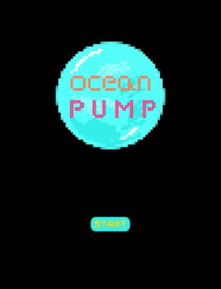
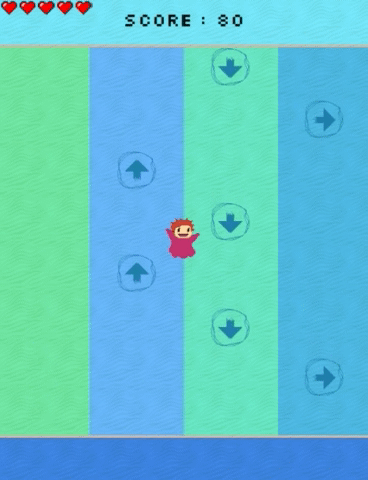
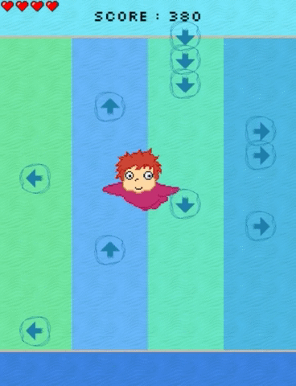
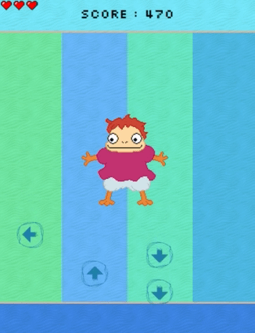

# Ocean Pump 🕹
### Interactive game projects using [Processing](https://processing.org/) 
</img>
> `Ocean Pump` is a processing version of the famous [pump it up!](https://en.wikipedia.org/wiki/Pump_It_Up_(video_game_series)) game.
> You can get points by tilting your cell phone in the same direction as the arrow in the screen. The motion sensing was developed by using [wekinator](http://www.wekinator.org/) and oscP5 library. 

You can see the [full version](https://youtu.be/wvy6SZK_SPo) on the YouTube. 
 Please enjoy watching! (like 👍 and subscribe 😻)   

### Details
</img> 
</img> 
</img> 
</img> 

